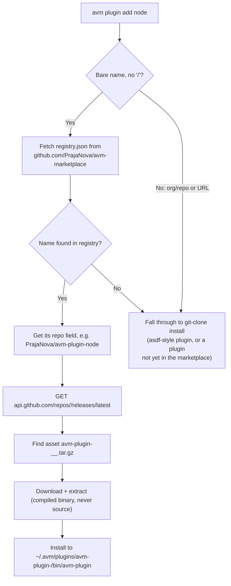

# avm Architecture

`avm` is a Rust-native CLI for project-local aliases, runtime selection,
shims, and a runtime plugin marketplace.

## Workspace crates

| Crate | Responsibility |
| --- | --- |
| `crates/avm-cli` | The `avm-bin` binary. Modules: `cli/` (command routing, shell protocol), `config`/`resolver` (`.avm.json` parsing, local/global merge rules, alias/env/tool resolution), `shims` (shim generation, PATH lookup), `runtime` (plugin discovery, the protocol host runner `PluginProcess`, the marketplace installer, the legacy asdf compatibility adapter). |
| `crates/avm-plugin-api` | The `ToolProvider` trait, the plugin wire-protocol types (`protocol` module), and the `runner` module every plugin's `main.rs` calls. This is the one crate a plugin repo depends on. |

**Nothing else is compiled into `avm-bin`.** node, java, and android are
not workspace members — they're separate repos
([avm-plugin-node](https://github.com/PrajaNova/avm-plugin-node),
[avm-plugin-java](https://github.com/PrajaNova/avm-plugin-java),
[avm-plugin-android](https://github.com/PrajaNova/avm-plugin-android)),
fetched at runtime the same way a third-party plugin would be. See
[Creating a plugin](../plugins/CREATING_A_PLUGIN.md) to add one.

## Config model

```json
{
  "aliases": { "dev": "pnpm run dev" },
  "env": { "NODE_ENV": "development" },
  "tools": { "node": "20.11.1" }
}
```

Legacy flat-map files (`{"dev": "pnpm run dev"}`) are still accepted and
migrated on read.

Resolution order: local `.avm.json` → global `~/.avm.json` → plugin/provider
aliases → system command fallback.

## The plugin marketplace

`avm plugin add <name>` is the only install path — nothing works out of
the box. It resolves in two stages:



`provider_by_name` (`crates/avm-cli/src/cli/tool_commands.rs`) is the
single lookup every command goes through, in two tiers:

1. `PluginManager::protocol_provider` — a marketplace-installed plugin
   under `~/.avm/plugins/avm-plugin-<name>/bin/avm-plugin`.
2. `PluginManager::asdf_provider` — the legacy compatibility adapter, for
   community asdf-style plugins (`bin/list-all`, `bin/install`, ...) that
   haven't adopted the native protocol. Permanent fallback tier, not
   temporary.

If neither resolves the name, and the marketplace registry *does* list it,
the error tells you to run `avm plugin add <name>` instead of just
"unknown plugin."

## The plugin protocol

Every provider — first-party or third-party — is a standalone executable
speaking one JSON-over-stdio contract:
`avm-plugin-<name> <command> [args...]`, one JSON document on stdout per
"read" command (`manifest`, `versions`, `is-installed`,
`installed-versions`, `executable-path`, `env-vars`); `install`/`uninstall`
instead inherit stdio (so progress streams live) and signal success via
exit code alone. `PluginProcess` (`avm-cli/src/runtime.rs`) is the host-side runner:
it spawns the executable, enforces a timeout, and parses the JSON —
malformed output is a normal `Err`, never a panic.

Full protocol reference and a build-your-own-plugin walkthrough:
[Creating a plugin](../plugins/CREATING_A_PLUGIN.md).

## Runtime boundaries

- CLI commands stay in `avm-cli/src/cli`.
- Config and resolver logic stays in `avm-cli/src/{config,resolver}.rs`.
- Provider contracts and the wire protocol stay in `avm-plugin-api`.
- Plugin discovery, the protocol host runner, the marketplace installer,
  and the asdf adapter stay in `avm-cli/src/runtime.rs`.
- Shim creation and PATH handling stay in `avm-cli/src/shims.rs`.

`package.json` script aliases are read in-process (`cli/state.rs`), not via
the node plugin: it's a hot path (alias resolution runs on every command).

## Global packages across local version switches

A binary installed by a global package manager invocation (e.g.
`npm install -g <pkg>` under the globally-pinned Node) stays reachable even
when a *different* local version is active in a project. Shim resolution
(`resolve_managed_binary` in `crates/avm-cli/src/cli/shim_commands.rs`)
tries the local pin's bin directory first, then falls back to the global
pin's, for any binary that isn't itself a pinned tool name — so `node`
itself always resolves to whichever version is actually selected
(local-over-global), while a global-only tool like a globally-installed CLI
package is found via the fallback.
