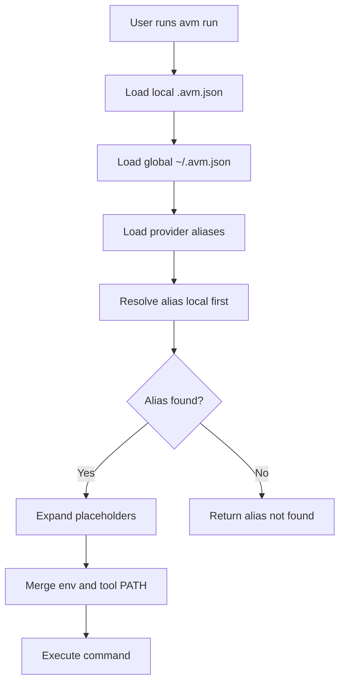
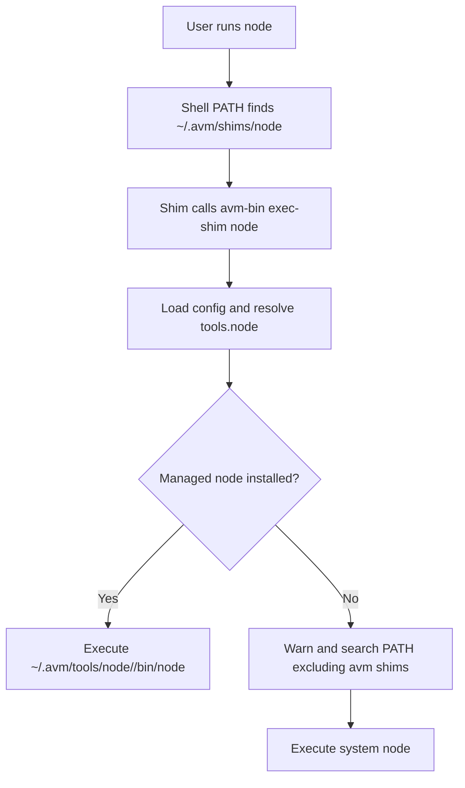
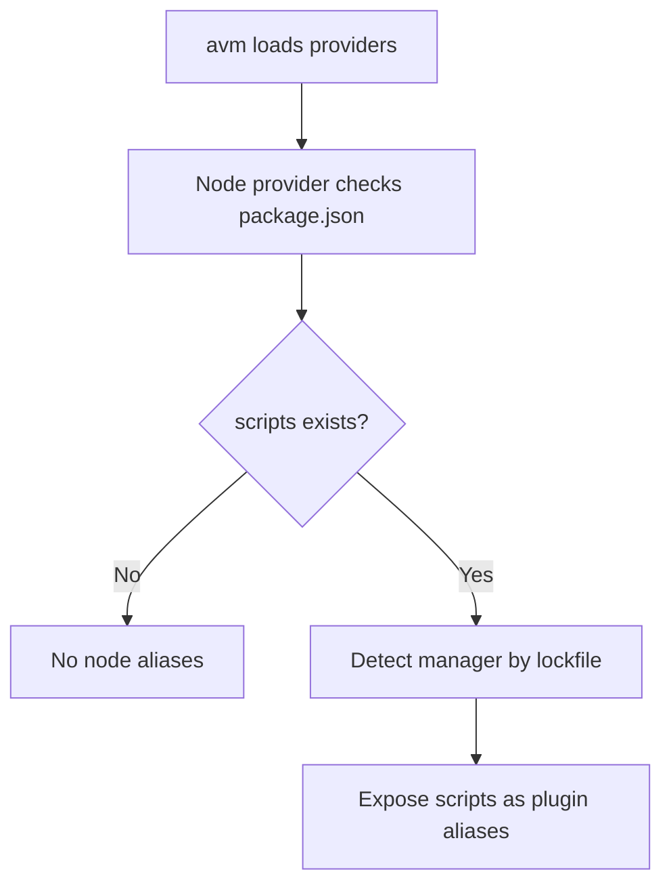
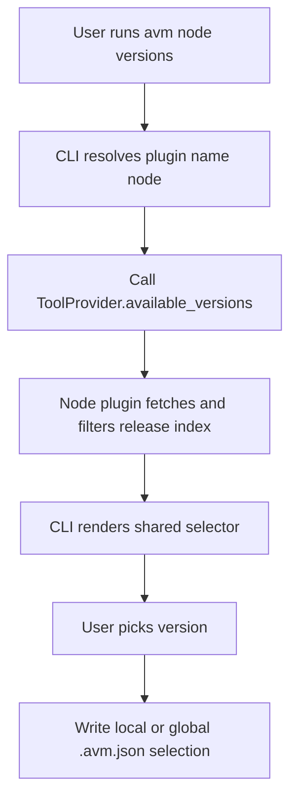
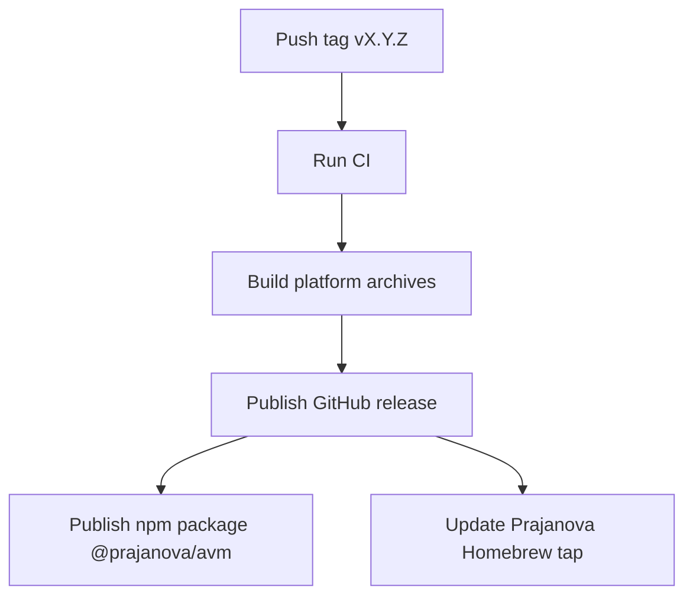

# avm Runtime Flow

## Alias execution

## Plain binary execution through shims

## Node package script provider

Manager detection order:

1. `bun.lockb` or `bun.lock`
2. `pnpm-lock.yaml`
3. `yarn.lock`
4. `npm run`

## Plugin version selection

## Release flow

